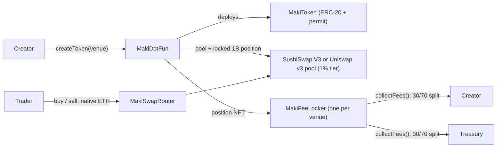

Everything on maki.finance is on-chain and permissionlessly integrable. You can build trading bots, indexers, dashboards, or entire alternative frontends. No API key required.

## Two ways to integrate

<CardGroup cols={2}>
  <Card title="TypeScript SDK" icon="js" href="/developers/sdk">
    `@maki-studio/sdk`: typed reads, writes, exact client-side quote math, and event streaming on top of viem. The fastest way to build.
  </Card>
  <Card title="Raw contracts" icon="file-contract" href="/developers/contracts">
    Call the launchpad directly from Solidity, Foundry scripts, or any web3 library. Full function and error reference.
  </Card>
</CardGroup>

## Robinhood Chain

| | Mainnet | Testnet |
| --- | --- | --- |
| Chain ID | `4663` | `46630` |
| RPC | `https://rpc.mainnet.chain.robinhood.com` | `https://rpc.testnet.chain.robinhood.com` |
| Explorer | [robinhoodchain.blockscout.com](https://robinhoodchain.blockscout.com) | [robinhoodchain-testnet.blockscout.com](https://robinhoodchain-testnet.blockscout.com) |
| Gas token | ETH (18 decimals) | Testnet ETH ([faucet](https://faucet.testnet.chain.robinhood.com)) |

Robinhood Chain is an **Arbitrum Orbit L2**. Two practical consequences:

- Blocks are fast and reorgs are effectively nonexistent, so confirmation counts of 0-1 are fine.
- The public RPC is **HTTP only** (no `eth_subscribe` websocket). The SDK's event layer is built around chunked `eth_getLogs` polling for exactly this reason; for websockets you need a paid RPC provider.

## Architecture

There is no intermediate trading phase and no migration step. [`createToken`](/protocol/direct-listing) lists a token directly on **SushiSwap V3 or Uniswap v3** (the creator picks the [venue](/protocol/venues) per launch) in one transaction:

1. deploys the ERC-20 (a CREATE2 salt is mined so the token always sorts above WETH),
2. creates and initializes the WETH/token 1% pool at the global opening price (tick 203200),
3. mints the **entire 1B supply** as one single-sided position spanning `[TICK_LOWER, startTick]` into that venue's fee locker, forever,
4. optionally executes the creator's dev buy before anyone else can reach the pool.

The venue is frozen into the token; a token lives on exactly one DEX. And because no liquidity was ever minted above `startTick`, the opening price is a permanent floor: sells can never push the price above it.



| Contract | Role |
| --- | --- |
| **MakiDotFun** | Singleton launchpad and registry for both venues: token factory, pool creation, position locking, fee config, creation-fee ledger. |
| **MakiToken** | Per-launch ERC-20 (+ EIP-2612). Fixed 1B supply, no admin functions, immutable `metadataURI`. |
| **MakiFeeLocker** | One per venue, byte-identical. Immutable, ownerless vault holding every launch's LP position forever; splits harvested swap fees creator/treasury at the token's launch-time snapshot (30/70 under the current config). |
| **MakiSwapRouter** | Stateless, ownerless, immutable ETH-in/ETH-out swapper working identically against pools on either venue. |

Only the launchpad and swap router addresses are needed to integrate. The lockers, treasury, WETH, position managers, and factories are all discoverable from the launchpad on-chain.

## Why MakiSwapRouter

Uniswap v3 has a SwapRouter02 on this chain; Sushi does not. Sushi routes through RedSnwapper, whose calldata is an opaque route produced by Sushi's off-chain routing API, and a pool seconds old is not indexed yet, which is exactly when a launchpad needs trading to work. So MakiSwapRouter talks to the pool directly with its own swap callback: identical on both venues, live the instant the pool exists, no API and no route encoding. It takes and returns native ETH, and it only ever swaps against a pool it re-derived from a known factory.

## Contract addresses

Live on mainnet since block 29,588,143 (2026-08-06), source-verified on Blockscout:

| Contract | Mainnet (4663) |
| --- | --- |
| MakiDotFun | [`0x6e4Feb8C6D71F3E29230411ba1097802dDC40C1e`](https://robinhoodchain.blockscout.com/address/0x6e4Feb8C6D71F3E29230411ba1097802dDC40C1e) |
| MakiFeeLocker (Sushi) | [`0xdb551DCC67DeCD8466Fd0168beFf58fEa95D9c8f`](https://robinhoodchain.blockscout.com/address/0xdb551DCC67DeCD8466Fd0168beFf58fEa95D9c8f) |
| MakiFeeLocker (Uniswap) | [`0x2cEf9adA6fEB71CC8097464bFc50db1Eade13C86`](https://robinhoodchain.blockscout.com/address/0x2cEf9adA6fEB71CC8097464bFc50db1Eade13C86) |
| MakiSwapRouter | [`0xdF217d53c4217bE86f2ec4156f89006E4ECfa52d`](https://robinhoodchain.blockscout.com/address/0xdF217d53c4217bE86f2ec4156f89006E4ECfa52d) |
| Treasury / owner | [`0x4f8a44D1831352dFfa4E3cb9FdB668F90C75d096`](https://robinhoodchain.blockscout.com/address/0x4f8a44D1831352dFfa4E3cb9FdB668F90C75d096) |

<Note>
  There is no testnet deployment: neither DEX exists on Robinhood Chain testnet. Develop against a local Anvil fork of mainnet instead (`anvil --fork-url https://rpc.mainnet.chain.robinhood.com`).
</Note>

## Key protocol constants

```text
TOTAL_SUPPLY       = 1_000_000_000 × 1e18   // per token, all of it in the locked position
POOL_FEE           = 10000                  // 1% tier, both venues
TICK_SPACING       = 200
TICK_LOWER         = -887200                // bottom of the locked position
startTick          = 203200                 // opening price: ≈667.46M tokens/ETH, ≈1.4982 ETH FDV
Creation fee       = 0.001 ETH flat         // current global config
Creator LP share   = 3000 bps (30%)         // current global config; rest to treasury
Venue.UNISWAP = 0, Venue.SUSHI = 1
```

There is **no per-trade launchpad fee**. Protocol and creator revenue is the pool's own 1% swap fee accruing to the locked position, harvested through the venue's FeeLocker and split at the token's snapshotted `creatorLpShareBps`. The global config (`creatorLpShareBps`, `creationFee`) is owner-tunable for future launches only: each token snapshots it at `createToken` and its split never changes. See [fees](/protocol/fees) and [security](/protocol/security).
