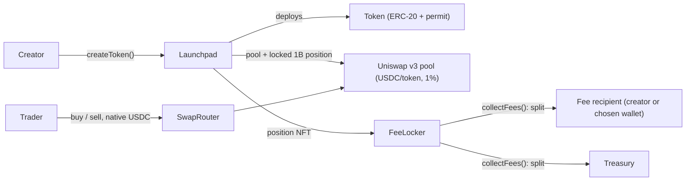

Everything on veto.fun is on-chain and permissionlessly integrable. You can build trading bots, indexers, dashboards, launch buttons in your own product, or entire alternative frontends. No API key required.

## Three ways to integrate

<CardGroup cols={3}>
  <Card title="TypeScript SDK" icon="js" href="/developers/sdk">
    `@vetodotfun/sdk`: typed reads, writes, exact client-side quote math, and event streaming on top of viem. The fastest way to build.
  </Card>
  <Card title="Token creation flow" icon="rocket" href="/developers/launch-integration">
    Add a Veto launch to your own app or bot, route the creator fee stream to any wallet, and track who is paid.
  </Card>
  <Card title="Raw contracts" icon="file-contract" href="/developers/contracts">
    Call the launchpad directly from Solidity, Foundry scripts, or any web3 library. Full function and error reference.
  </Card>
</CardGroup>

## Arc

| | Mainnet | Testnet |
| --- | --- | --- |
| Chain ID | `5042` | `5042002` |
| RPC | `https://rpc.mainnet.arc.io` | `https://rpc.testnet.arc.io` (also `wss://`) |
| Explorer | [explorer.arc.io](https://explorer.arc.io) | [explorer.testnet.arc.io](https://explorer.testnet.arc.io) |
| Gas token | USDC | Testnet USDC ([faucet](https://faucet.circle.com)) |
| Blocks / finality | ~500 ms, final on inclusion | same |

Arc is Circle's EVM Layer 1 (Osaka baseline). Four practical consequences:

- **USDC is the gas token and has two decimal views.** At the native level (`msg.value`, `eth_getBalance`, every amount the SDK takes or returns) it has **18 decimals**, like wei. The same balance is exposed as an ERC-20 at `0x3600000000000000000000000000000000000000` with **6 decimals**. Never mix the two representations; the factor is 10¹².
- **There is no WETH.** Pools quote directly in the USDC ERC-20; the launchpad never wraps anything.
- **Finality is deterministic.** A transaction in a committed block is final. Don't count confirmations; do order events by `(blockNumber, logIndex)`, since sub-second blocks can share a timestamp.
- **The public RPC is HTTP-only and capped.** No `eth_subscribe`; `eth_getLogs` rejects spans above about 2000 blocks. The SDK's event layer polls in chunks for exactly this reason. Use a paid RPC (Alchemy, QuickNode, dRPC) for anything serious.

Value transfers to `address(0)` revert on Arc, `PREVRANDAO` is always 0, and blob transactions are not supported. Full list in Arc's [EVM differences](https://docs.arc.io/arc/references/evm-differences).

## Architecture

There is no intermediate trading phase and no migration step. [`createToken`](/protocol/direct-listing) lists a token directly on **Uniswap v3** in one transaction:

1. deploys the ERC-20 (a CREATE2 salt is mined so the token always sorts above USDC),
2. creates and initializes the USDC/token pool at the global opening price, on the fee tier the creator picked (0.3% or 1%),
3. mints the **entire 1B supply** as one single-sided position spanning `[TICK_LOWER, startTick]` into the fee locker, forever,
4. optionally executes the creator's dev buy before anyone else can reach the pool.

Because no liquidity was ever minted above `startTick`, the opening price is a permanent floor: sells can never push the price above it.



| Contract | Role |
| --- | --- |
| **Launchpad** | Singleton launchpad and registry: token factory, pool creation, position locking, fee config, fee-recipient registry, creation-fee ledger. |
| **Token** | Per-launch ERC-20 (+ EIP-2612). Fixed 1B supply, no admin functions, immutable `metadataURI`. |
| **FeeLocker** | Immutable, ownerless vault holding every launch's LP position forever; splits harvested swap fees recipient/treasury at the token's launch-time snapshot. |
| **SwapRouter** | Stateless, ownerless, immutable USDC-in/USDC-out swapper against launch pools, live the instant a pool exists. |

Only the launchpad and swap router addresses are needed to integrate. The locker, treasury, position manager and factory are all discoverable from the launchpad on-chain.

## Contract addresses

Contract addresses are published here, in `@vetodotfun/sdk`'s `deployments.arc`, and on [explorer.arc.io](https://explorer.arc.io) (source-verified) at launch. Until then, develop against an `arc-anvil` fork of Arc mainnet ([Arc Foundry](https://github.com/circlefin/arc-foundry)) and pass the fork's deployment object to the SDK; Uniswap v3 is not deployed on Arc testnet.

Canonical Uniswap v3 on Arc, which the launchpad builds on: factory `0xf0db7b58379503491d857db50ac9ece64c653918`, position manager `0x39654a85a4c05127f5fd6ed22caec077a0fb1377`.

## Key protocol constants

```text
TOTAL_SUPPLY       = 1_000_000_000 × 1e18   // per token, all of it in the locked position
POOL_FEES          = 3000 | 10000           // 0.3% or 1%, creator's choice, fixed per token
TICK_SPACING       = 200
TICK_LOWER         = -887200                // bottom of the locked position
startTick          = read launchGeometry()  // opening price: a fixed USD FDV, identical for every launch
Creation fee       = read feeConfig()       // flat, in USDC
Creator LP share   = 5000 bps (50%)         // current global config; rest to treasury
Venue.UNISWAP = 0
```

There is **no per-trade launchpad fee**. Protocol and creator revenue is the pool's own 1% swap fee accruing to the locked position, harvested through the FeeLocker and split at the token's snapshotted `creatorLpShareBps`. The global config (`creatorLpShareBps`, `creationFee`) is owner-tunable for future launches only: each token snapshots it at `createToken` and its split never changes. See [fees](/protocol/fees) and [security](/protocol/security).

## Public API

veto.fun's own backend exposes a few read-only endpoints that are handy for integrators (no key, CORS open):

| Endpoint | Returns |
| --- | --- |
| `GET https://api.veto.fun/api/launchpad/config` | Contract addresses, venue, launch geometry, current fee config |
| `GET https://api.veto.fun/api/launchpad/pool/:token` | Pool address, venue, creator, creation block |
| `GET https://api.veto.fun/api/launchpad/recipient/:token` | `{ creator, feeRecipient, creatorLpShareBps }` — who the creator fee stream pays |

Market data (candles, trades, holders) is not served by us: read it from the pool directly, or from GeckoTerminal (network `arc`) / DexScreener (chain `arc`), which index every launch pool from its first swap.

