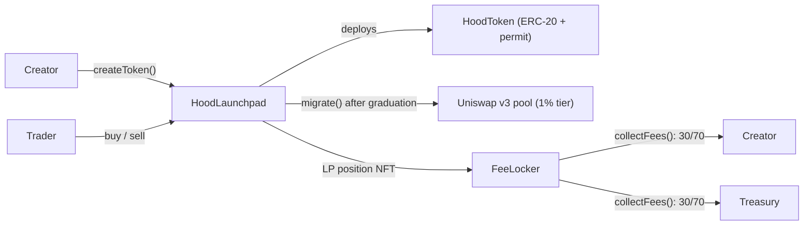

Everything on hoodstar.fun is on-chain and permissionlessly integrable. You can build trading bots, indexers, dashboards, or entire alternative frontends — no API key required.

## Two ways to integrate

<CardGroup cols={2}>
  <Card title="TypeScript SDK" icon="js" href="/developers/sdk">
    `@hoodstar/sdk` — typed reads, writes, exact client-side quote math, and event streaming on top of viem. The fastest way to build.
  </Card>
  <Card title="Raw contracts" icon="file-contract" href="/developers/contracts">
    Call the launchpad directly from Solidity, Foundry scripts, or any web3 library. Full function and error reference.
  </Card>
</CardGroup>

## Robinhood Chain

| | Mainnet | Testnet |
| --- | --- | --- |
| Chain ID | `4663` | `46630` |
| RPC | `https://rpc.mainnet.chain.robinhood.com` | `https://rpc.testnet.chain.robinhood.com` |
| Explorer | [robinhoodchain.blockscout.com](https://robinhoodchain.blockscout.com) | [robinhoodchain-testnet.blockscout.com](https://robinhoodchain-testnet.blockscout.com) |
| Gas token | ETH (18 decimals) | Testnet ETH ([faucet](https://faucet.testnet.chain.robinhood.com)) |

Robinhood Chain is an **Arbitrum Orbit L2**. Two practical consequences:

- Blocks are fast and reorgs are effectively nonexistent — confirmation counts of 0–1 are fine.
- The public RPC is **HTTP only** (no `eth_subscribe` websocket). The SDK's event layer is built around chunked `eth_getLogs` polling for exactly this reason; for websockets you need a paid RPC provider.

## Architecture

Three contracts run the whole protocol:



| Contract | Role |
| --- | --- |
| **HoodLaunchpad** | Singleton: token factory, all bonding curves, fee ledger, and Uniswap migrator in one contract. |
| **HoodToken** | Per-launch ERC-20 (+ EIP-2612). Fixed 1B supply, no admin functions, immutable `metadataURI`. |
| **FeeLocker** | Immutable, ownerless vault holding every graduated LP position forever; splits collected swap fees 30% creator / 70% treasury (mirrors the curve fee ratio). |

Only the launchpad address is needed to integrate — the FeeLocker, treasury, WETH, and Uniswap position manager are all discoverable from it on-chain.

## Contract addresses

Live on mainnet since block 9,651,439 (2026-07-14), source-verified on Blockscout:

| Contract | Mainnet (4663) |
| --- | --- |
| HoodLaunchpad | [`0x46476743520DCEE36919D8a826F7f3D82c65c1F0`](https://robinhoodchain.blockscout.com/address/0x46476743520DCEE36919D8a826F7f3D82c65c1F0) |
| FeeLocker | [`0x9d86E293CB8C033694F21A7c1fA63e97Dd2f98de`](https://robinhoodchain.blockscout.com/address/0x9d86E293CB8C033694F21A7c1fA63e97Dd2f98de) |

<Note>
  There is no testnet deployment: Uniswap v3 is not deployed on Robinhood Chain testnet, which the protocol depends on for graduation. Develop against a local Anvil fork of mainnet instead.
</Note>

Canonical Robinhood Chain infrastructure the protocol builds on:

| Contract | Address |
| --- | --- |
| Uniswap v3 Factory | `0x1f7d7550B1b028f7571E69A784071F0205FD2EfA` |
| Uniswap v3 NonfungiblePositionManager | `0x73991a25C818Bf1f1128dEAaB1492D45638DE0D3` |
| Uniswap SwapRouter02 | `0xCaf681a66D020601342297493863E78C959E5cb2` |
| WETH | `0x0Bd7D308f8E1639FAb988df18A8011f41EAcAD73` |

## Key protocol constants

```text
TOTAL_SUPPLY     = 1_000_000_000 × 1e18   // per token
SALE_SUPPLY      =   793_100_000 × 1e18   // sold on the curve
POOL_SUPPLY      =   206_900_000 × 1e18   // reserved for Uniswap LP
VIRTUAL_TOKEN_0  = 1_073_000_000 × 1e18   // initial virtual token reserve
virtualEth0      = 1.6 ETH                // initial virtual ETH reserve (deploy parameter)
Trade fee        = 100 bps (70 protocol / 30 creator) — immutable, no setter
LP fee split     = 3000 bps creator share, derived from the trade-fee ratio
Uniswap pool     = 1% fee tier (10000), full-range position
```
